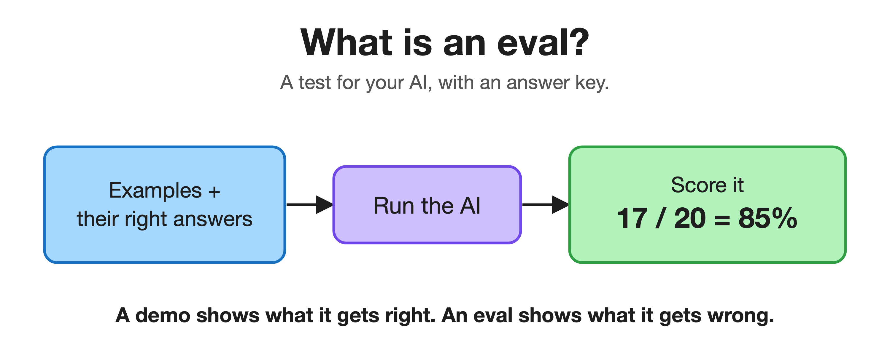
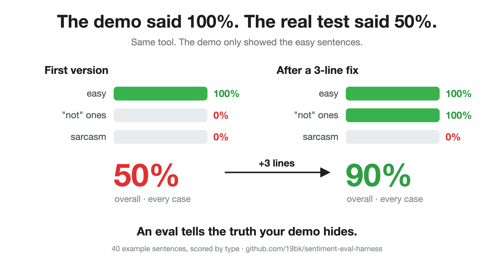
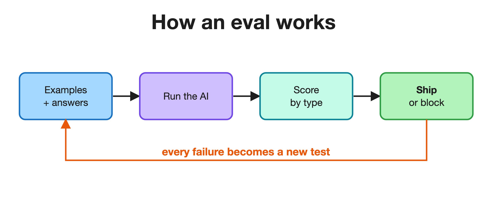

<!--
LinkedIn article draft (v2, rethought). To publish:
  1. LinkedIn > Write article. Title + subtitle go in LinkedIn's own fields.
  2. Cover image: assets/img-result.png (the strongest one).
  3. Upload the three new PNGs from assets/ at the [IMAGE] marks: img-eval, img-result, img-loop.
  4. LinkedIn does NOT render Markdown. Retype headings/bold natively and upload images by hand.
Also pair it with a short teaser FEED post that links here (articles get low reach on their own).
Audience: mostly non-technical, plus the few who could hire. Voice: plain English, no em dashes.
Compliance: neutral domain, no client/RR-IP, no exit signals. Every number traces to this repo.
-->

# My AI scored 100% in the demo. The real test said 50%.

*I spent years keeping machines alive in the field. Here is the habit I brought to AI, in plain English.*

For six years my job was keeping machines alive in the field. Pumps, sensors, fuel devices, thousands of them across three countries. You learn one rule fast: a machine that behaves when you test it gently tells you nothing. What matters is what it does at 2am, on a bad connection, when nobody is watching.

Now I build AI systems, and the same rule holds. Most people are ignoring it.

Here is what I mean. I built a small AI tool and showed it off. Every example I tried, it got right. 100%. It felt finished.

Then I tested it the way I would test a machine, by throwing the hard cases at it, the ones I would never put in a demo. It was right half the time.

## An eval is just a test with an answer key

That test has a name: an eval. It is the simplest idea in the world. You gather real examples where you already know the correct answer, run them all through the AI, and score it like a teacher marking a paper. Instead of "it seems good," you get "it is right 85% of the time, and here is exactly where it fails."

Why does AI need this when normal software does not? Because normal software is predictable. Type 2 + 2 and you get 4, today and forever. AI is not like that. Ask it the same thing twice and it can be right once and confidently wrong the next, and the wrong answer sounds just as sure as the right one. You cannot trust a feeling. You need a number.

## I watched it happen on my own tool

My tool read a sentence and decided whether it sounded happy or unhappy. In the demo, perfect. In a real test, 50%.

The test showed me exactly where it broke. It nailed the easy sentences and got the tricky ones backwards, every time. "Not bad." "Wasn't terrible." "I can't complain." The words look negative, the meaning is positive, and my tool was only counting happy and sad words. It could not see the word "not." A demo full of cheerful examples was never going to show me that.

The fix was about three lines. The score jumped to 90%.

## The best thing a test can do is hand you the next problem

Then the test did the thing I value most. It pointed straight at the next wall: it still scores zero on sarcasm, like "Oh great, it broke again." That is not the test failing. That is the test writing my next to-do list. Every failure you find becomes an example you keep, so the thing can never break that way again without you knowing.

That is the whole loop, and it works the same whether you are checking three lines of code or the most capable AI on the planet.

## Why this matters, even if you never write code

AI is moving past answering questions. It is starting to do things on its own: book, buy, reply, decide, across many steps in a row. One confident mistake early quietly poisons everything that comes after it. When a refund, a paycheck, or a delivery rides on that, "it looked fine when we tried it" is not an answer. Someone has to be able to say, with evidence, how often it is right and where it breaks.

That is the work I do: I make AI prove it works, in numbers a business can trust, and I find the failures before the customer does. It is the hardware habit, pointed at AI. Do not trust what you have not measured.

I write about making AI trustworthy, in plain English. The little project behind this post is public, runs in seconds, and needs nothing installed: **github.com/19bk/sentiment-eval-harness**

One question to leave you with: what is the most confidently wrong answer an AI has ever given you?
