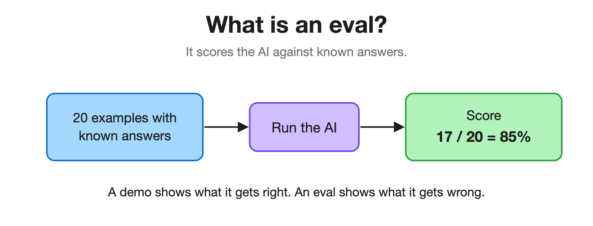
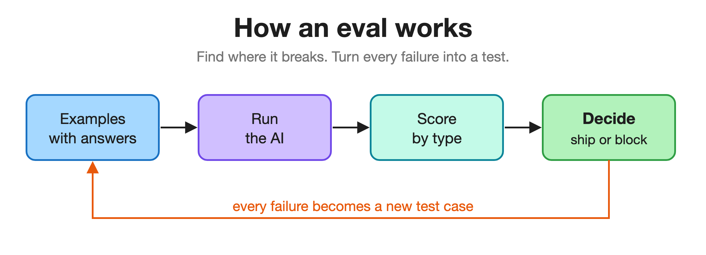
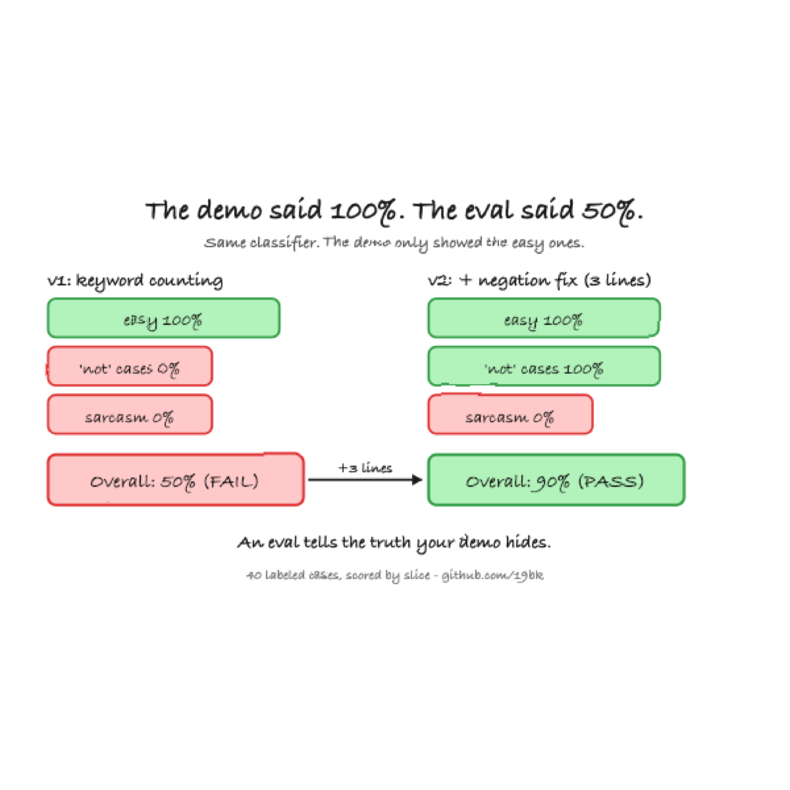

<!--
LinkedIn article draft. To publish:
  1. LinkedIn → Write article. Title + subtitle go in the LinkedIn fields (below).
  2. Upload the three PNGs from assets/ at the [IMAGE] marks (export-free; they're committed).
  3. Image 3 (results) also makes the strongest cover image.
  Note: LinkedIn's editor does NOT render Markdown. Don't paste this file raw; retype headings/bold
  using LinkedIn's native formatting and upload the images by hand. (This file is the GitHub writeup.)
This file also renders as the repo's long-form writeup on GitHub (images embed via relative paths).
Voice: plain English, no em dashes. All numbers trace to this repo.
-->

# The demo said 100%. The eval said 50%.

*A plain-English guide to evals: the difference between using AI and proving it works.*

## Start here: what is an eval?

Normal software you can test once and trust forever. 2 + 2 is 4 today, tomorrow, and in a year. Write the test once and you are done.

AI does not work like that. Ask it the same question twice and you can get a good answer one time and a confidently wrong one the next, and the wrong answers sound exactly as convincing as the right ones. Worse, you only ever see the handful of cases you happen to try. "It looked great when I tried it" tells you nothing about the cases you did not.

An eval fixes that. You collect example inputs where you already know the right answer, run the AI against all of them, and count how many it gets right. That turns a feeling ("seems good") into a number ("right 85% of the time, and here is exactly where it fails").

## The method, in four steps

1. **Labeled dataset:** examples with known answers.
2. **Run the system:** it could be three lines of rules or a frontier model. The harness does not care.
3. **Score by slice:** not one overall number, but a number per type of case (a "slice"). This is the part that does the work.
4. **Gate:** if the score clears your bar, ship. If it drops below, block.

And then the part most people skip: every failure you find becomes a new example in the dataset. The suite grows into a memory of every way the thing has ever broken, so it can never break that way again without you knowing.

## A tiny example you can run in seconds

I wrote a sentiment classifier. It reads a sentence and says happy or unhappy. In my demo it was 100% accurate on every example I showed.

Then I wrote a short eval, under a hundred lines, and ran it against the cases a demo never shows. It was actually 50%.

The slices showed exactly what was wrong. It scored 100% on easy sentences and 0% on negation. The classifier counts positive and negative words, so it nailed "this is great" and "this is terrible" but got every "not bad," "wasn't terrible," "I can't complain" backwards. It cannot see the word "not." A happy-path demo would never have surfaced that.

The fix was three lines: flip a sentiment word when a negator sits in front of it. That took it from 50% to 90%.

Then the eval did the most useful thing of all. It pointed at the next wall: both versions still score 0% on sarcasm ("Oh great, it broke again"). That is not the eval failing. That is the eval handing me the spec for the next version.

## Three things I took from it

1. **A headline number lies; a slice tells the truth.** "50% overall" is useless. "100% on easy, 0% on negation" tells you exactly what to fix.
2. **The demo is not the test.** A demo shows the cases your system already handles. The eval holds the cases you would never think to show.
3. **A good eval does not just grade, it points.** Every failure becomes the next test case.

## Why this is about to matter more

A plain AI answers a question. An agent takes actions on its own to finish a task: it searches, uses tools, runs many steps in a row. One wrong step early snowballs through every step after it. The more we hand to agents, the more "it looked fine when I tried it" stops being good enough. A score you can defend is the whole game.

The classifier here is a deliberate toy: rules, not a model. The eval harness is the point, and the same harness works whether you are testing three lines of rules or a frontier LLM. Swap the classifier for an API call and nothing else changes.

It is public, has no dependencies, and runs in seconds: **github.com/19bk/sentiment-eval-harness**
